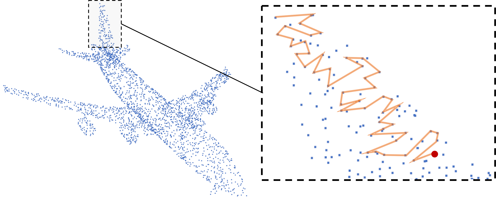

# MortonNet: Self-Supervised Learning of Local Features in 3D Point Clouds



MortonNet is a self-supervised approach for point cloud processing. 
MortonNet learns local geometric features for each point. Given a
point cloud, our approach creates sequences for each point. These
sequences are based on the popular Morton order. With a sequence of
`N` points, MortonNet uses the first `N - 1` points and learns to
predict the last point. We show how to use MortonNet with the
[S3DIS Dataset](http://buildingparser.stanford.edu/dataset.html).

### Data
We download and prepare the data using the tools provided by 
[Engelmann et. al.](https://www.vision.rwth-aachen.de/media/papers/PID4967025.pdf)
available [here](https://github.com/VisualComputingInstitute/3d-semantic-segmentation).
To download the dataset fill in this [form](https://docs.google.com/forms/d/e/1FAIpQLScDimvNMCGhy_rmBA2gHfDu3naktRm6A8BPwAWWDv-Uhm6Shw/viewform?c=0&w=1).
Next we process the data and convert to npy files for processing. This code is from
[Engelmann et. al.](https://github.com/VisualComputingInstitute/3d-semantic-segmentation):

```commandline
python prepare_s3dis.py --input_dir path/to/dataset --output_dir path/to/output
```

### Installation

All the required packages are in `environment.yml`. If you use conda,
you can directly run:

```commandline
conda env create -f environment.yml
```

If you prefer to use `pip` or any other alternative, you can create your
own requirements file using the packages and versions provided. This code 
was tested with Python 3.6 in Ubuntu 16.04, running CUDA 9.0 and cuDNN 7.4.1. All the package versions are 
available in the environment file. 

### Computing Sequences

Before training MortonNet, you have to compute the sequences to
feed in the self-supervised training scheme. To create sequences,
run the following:

```commandline
python tools/create_sequences.py --root_dir path/to/dataset --out_dir path/to/save.dir --phase train/valid/test
```

Note that the `path/to/dataset` here corresponds to the path with the npy files. 
By default this will compute sequences for all the available files. You
can specify a file id using the argument `--data_idx`. For more information
about available commands run the `--help` or `-h` options.

### Training MortonNet

Once the sequences are precomputed, you can train MortonNot with:

```commandline
python train.py --root_dir path/to/sequences --model_dir path/to/checkpoint/save
```

There are different ways to configure MortonNet parameters. Possible 
configurations are in `tools/config.py`. If you create your own config,
you can load it using argument `--config_type`. You can also specify 
other parameters like using multi GPUs, batch size, and others. For a
full list run the `--help` or `-h` options.

### Computing features

You can use the trained MortonNet to compute features for any point
cloud dataset. The features of every sequence come from the last hidden
state of the RNN. Since every point gets 5 sequences during sequence
computation, we can merge these features in different ways. We output
all 5 features for each point, which can later be concatenated or pooled.
To compute features run:

```commandline
python compute_features.py --root_dir path/to/sequences --best_path path/to/mortonnet/model --out_dir path/to/save/features
```
